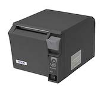
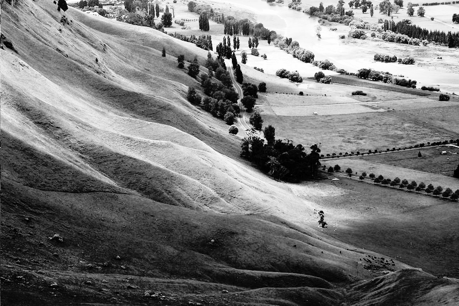
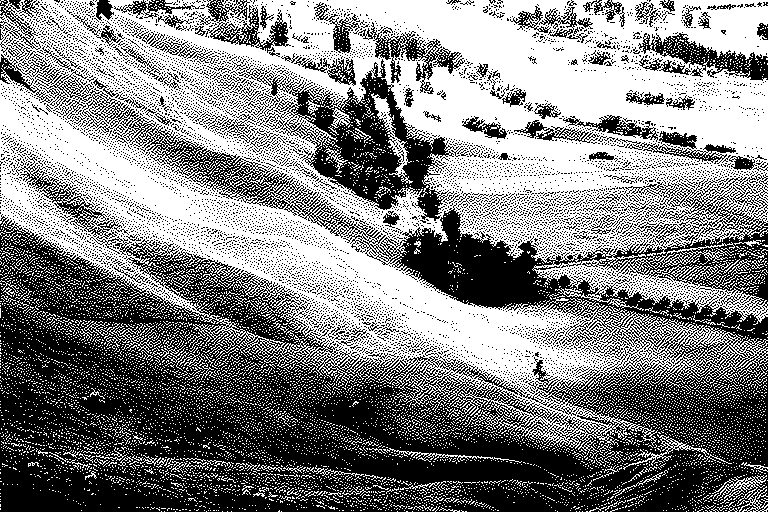

# png2pos

png2pos is a utility to convert PNG images to ESC/POS format — binary format used
by POS thermal printers. Output file can be just sent to printer.

png2pos is:

* **free** and open-source
* rock **stable**
* highly **optimized**, fast, tiny and lightweight (few KiBs binary, no lib dependencies)
* **secure** (does not require any escalated privileges)
* easy to use
* multiplatform (tested on Linux — x86 and ARM/Raspberry Pi, OS X and Windows)
* well **tested**
* 100% handcrafted in Prague, CZ :-)

## Pricing and Support

png2pos is free MIT-licensed software provided as is. *Unfortunately I am unable
to provide you with free support* and do not accept pull requests.

If you like png2pos and use it, please let me know, it motivates me in further development.

Important: png2pos will *never ever* be like Emacs; it is simple and specialized utility.

## Build

To build binary just type:

    $ make ↵

On Mac typically you can use clang preprocessor:

    $ make CC=clang ↵

### Available make targets

target | make will build…
:----- | :------
  | png2pos
clean | (removes intermediate products)
man | compressed man page
strip | stripped version (suggested)
profiled | profiled version (up to 3 % performance gain on repeat tasks)
install | install png2pos into /usr/local…
debug | debug version (creates PNG temp files after each step during input processing)
rpi | Raspberry Pi optimized version

png2pos has no lib dependencies and is easy to build and run on Linux, Mac and Windows.

## Command line options

option | value | meaning
:----- | :---- | :------
-V | | display the version number and exit
-h | | display this short help and exit
-c | | cut the paper at the end of job
-a | L,C,R | horizontal image alignment (Left, Center, Right)
-r | | rotate image upside down before it is printed
-p | | pre-process the images
-o | FILE | output file

With no FILE, or when FILE is -, write to standard output.

## Usage examples

    $ png2pos -c -r -a R /tmp/*.png > /dev/usb/lp0 ↵
    $ _

    $ png2pos -V ↵
    png2pos 1.5.3 (Dec  5 2014)
    LodePNG 20141130
    $ _

## How does it work?

png2pos accepts any PNG file (B/W, greyscale, RGBA), converts it to B/W bitmap
in ESC/POS format and prepends and adds other command sequences such as printer
initialization and paper cut. png2pos utilizes F50 and F112 ESC/POS commands.

### Examples

#### Lena
Original

Greyscale version

Post-processed version (Histogram Equalization Algorithm)

Produced B/W dithered version (Atkinson Dithering Algorithm)

#### Hawkes Bay
Greyscale version

Post-processed version (Histogram Equalization Algorithm)

Produced B/W dithered version (Atkinson Dithering Algorithm)

